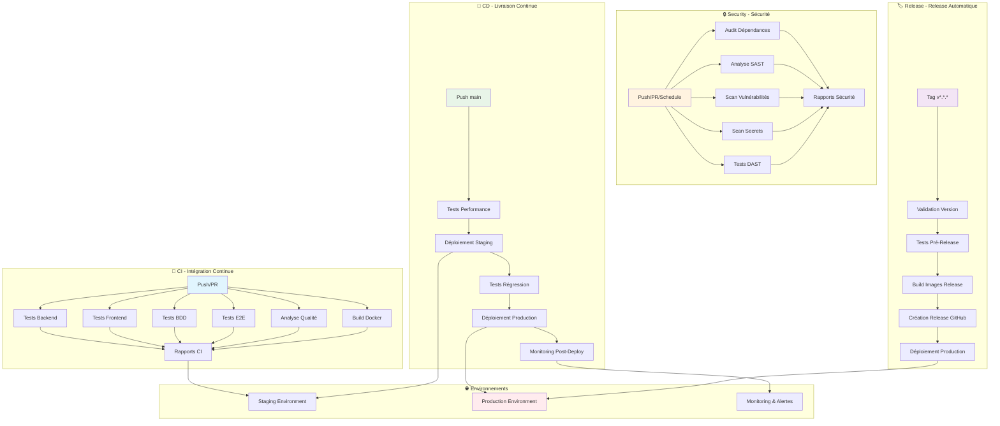
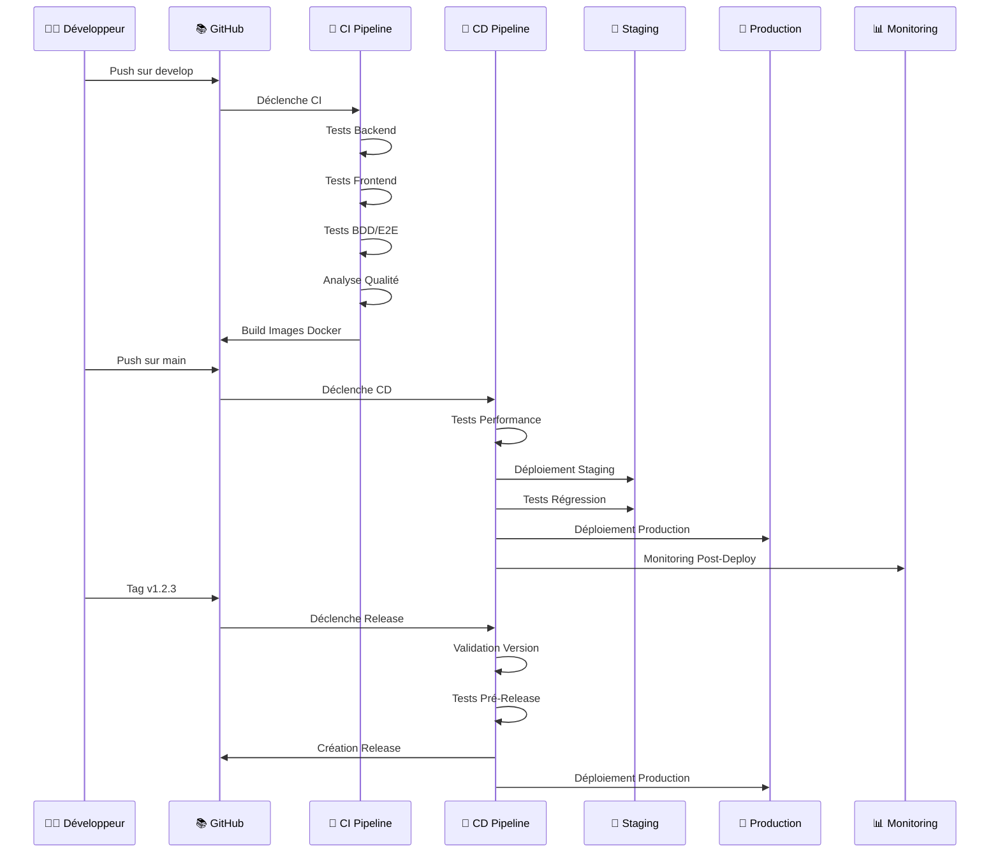
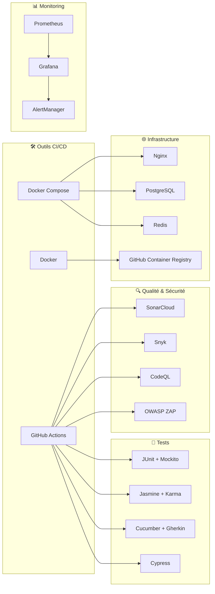
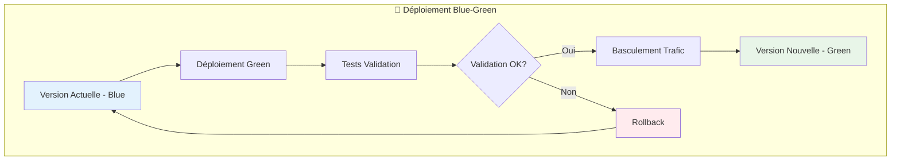
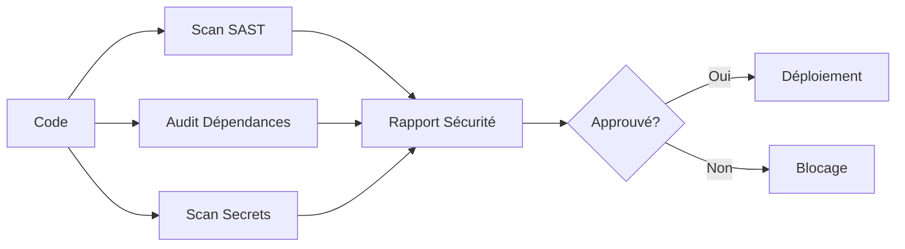

# 🏗️ Architecture des Pipelines CI/CD MedHead

## 📊 Diagramme d'Architecture

## 🔄 Flux de Données Détaillé

## 🏗️ Architecture Technique

### Stack Technologique

## 📋 Matrice des Déclencheurs

| Workflow | Push develop | Push main | PR | Tag | Schedule | Manual |
|----------|--------------|-----------|----|----|-----------|---------|
| **CI** | ✅ | ✅ | ✅ | ❌ | ❌ | ❌ |
| **CD** | ❌ | ✅ | ❌ | ✅ | ❌ | ✅ |
| **Security** | ✅ | ✅ | ✅ | ❌ | ✅ | ✅ |
| **Release** | ❌ | ❌ | ❌ | ✅ | ❌ | ✅ |

## 🎯 Stratégie de Déploiement

### Blue-Green Deployment

## 📊 Métriques et KPIs

### Métriques CI/CD

| Métrique | Objectif | Mesure |
|----------|----------|---------|
| **Durée CI** | < 15 min | Temps d'exécution |
| **Durée CD** | < 30 min | Temps de déploiement |
| **Taux Succès** | > 95% | Déploiements réussis |
| **MTTR** | < 10 min | Temps de récupération |
| **Couverture Tests** | > 90% | Backend / > 85% Frontend |

### Métriques Qualité

| Métrique | Objectif | Outil |
|----------|----------|-------|
| **Code Quality** | A | SonarCloud |
| **Vulnérabilités** | 0 Critique | Snyk |
| **Code Smells** | < 10 | SonarCloud |
| **Duplication** | < 3% | SonarCloud |

## 🔐 Sécurité et Conformité

### Pipeline de Sécurité

### Standards de Sécurité

- **OWASP Top 10** : Protection contre les vulnérabilités courantes
- **CWE** : Common Weakness Enumeration
- **NIST** : Guidelines de sécurité
- **GDPR** : Conformité protection des données

## 🚀 Évolutions Futures

### Roadmap

1. **Phase 1** : Implémentation actuelle ✅
2. **Phase 2** : Intégration Kubernetes
3. **Phase 3** : Multi-environnements
4. **Phase 4** : IA/ML pour optimisation

### Améliorations Prévues

- **Canary Deployments** : Déploiement progressif
- **Feature Flags** : Activation fonctionnalités
- **Auto-scaling** : Ajustement automatique des ressources
- **Chaos Engineering** : Tests de résilience

---

## 📚 Documentation Associée

- **[CI_CD_GUIDE.md](CI_CD_GUIDE.md)** - Guide complet des pipelines
- **[SECRETS_SETUP.md](.github/SECRETS_SETUP.md)** - Configuration des secrets
- **[README_CI_CD.md](README_CI_CD.md)** - Documentation principale
