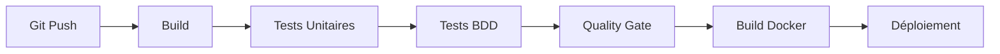
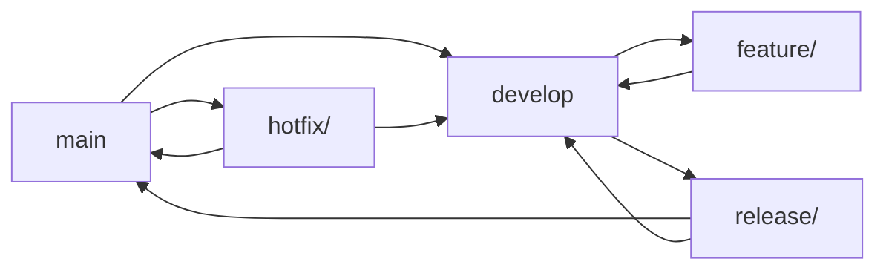

# 🏥 MedHead - Système d'Allocation de Lits d'Hôpital

[](https://github.com/medhead/poc)
[](https://openjdk.java.net/)
[](https://spring.io/projects/spring-boot)
[](LICENSE)

## 📋 Table des Matières

- [Vue d'ensemble](#-vue-densemble)
- [Architecture](#-architecture)
- [Prérequis](#-prérequis)
- [Installation](#-installation)
- [Tests](#-tests)
- [Pipeline CI/CD](#-pipeline-cicd)
- [Workflow Git](#-workflow-git)
- [API Documentation](#-api-documentation)
- [Déploiement](#-déploiement)
- [Contributing](#-contributing)

## 🎯 Vue d'ensemble

MedHead est un système d'allocation intelligente de lits d'hôpital qui recommande l'établissement le plus approprié en fonction de la spécialité médicale requise et de la localisation géographique du patient.

### Fonctionnalités principales

- 🔍 **Allocation intelligente** : Recommandation d'hôpital basée sur la spécialité et la géolocalisation
- 🏥 **Gestion des hôpitaux** : Catalogue d'établissements avec spécialités et disponibilité
- 🔐 **Sécurité** : Authentification et autorisation par rôles (ADMIN, MEDICAL_STAFF)
- 📊 **Anonymisation** : Protection des données personnelles des patients
- 🧪 **Tests BDD** : Scénarios de test avec Cucumber pour validation métier

## 🏗️ Architecture

```
┌─────────────────┐    ┌─────────────────┐    ┌─────────────────┐
│   Frontend      │    │   Backend       │    │   Database      │
│   (React/Vue)   │◄──►│   Spring Boot   │◄──►│   PostgreSQL    │
└─────────────────┘    └─────────────────┘    │   (Prod)        │
                               │               │   H2 (Test)     │
                               │               └─────────────────┘
                               ▼
                      ┌─────────────────┐
                      │   Monitoring    │
                      │   Actuator      │
                      └─────────────────┘
```

### Stack technique

- **Backend** : Spring Boot 3.5.6, Java 17
- **Base de données** : PostgreSQL (production), H2 (développement/test)
- **Sécurité** : Spring Security avec authentification par rôles
- **Tests** : JUnit 5, Cucumber (BDD), Maven Surefire
- **Documentation** : Spring Boot Actuator

## ⚙️ Prérequis

- **Java** : OpenJDK 17 ou supérieur
- **Maven** : 3.6+ (ou utilisez le wrapper inclus `./mvnw`)
- **Base de données** : PostgreSQL 12+ (pour la production)
- **Outils** : Git, IDE (IntelliJ IDEA, Eclipse, VS Code)

## 🚀 Installation

### 1. Cloner le repository

```bash
git clone https://github.com/medhead/poc.git
cd medhead
```

### 2. Configuration de la base de données

#### Développement (H2 - automatique)
```bash
# Aucune configuration requise, H2 démarre automatiquement
```

#### Production (PostgreSQL)
```bash
# Créer la base de données
createdb medhead_prod

# Configurer les variables d'environnement
export SPRING_DATASOURCE_URL=jdbc:postgresql://localhost:5432/medhead_prod
export SPRING_DATASOURCE_USERNAME=your_username
export SPRING_DATASOURCE_PASSWORD=your_password
```

### 3. Compilation et démarrage

```bash
cd backend

# Compilation
./mvnw clean compile

# Démarrage en mode développement
./mvnw spring-boot:run -Dspring-boot.run.profiles=dev

# Ou démarrage avec JAR
./mvnw clean package
java -jar target/poc-0.0.1-SNAPSHOT.jar --spring.profiles.active=dev
```

L'application sera accessible sur : `http://localhost:8080`

## 🧪 Tests

### Structure des tests

```
src/test/java/com/medhead/poc/
├── PocApplicationTests.java          # Tests unitaires Spring Boot
├── TestSuite.java                    # Suite de tests
└── bdd/
    ├── runners/
    │   └── CucumberBddTest.java      # Tests BDD Cucumber
    └── steps/
        ├── AllocationSteps.java      # Étapes d'allocation
        ├── PerformanceSteps.java     # Tests de performance
        └── ...                       # Autres étapes BDD
```

### Exécution des tests

#### Tests unitaires (recommandé)
```bash
# Tests unitaires uniquement
./mvnw test

# Ou avec le script optimisé
./run-tests.sh unit
```

#### Tests BDD Cucumber
```bash
# Tests BDD séparément
./mvnw test -Pbdd-tests

# Ou avec le script
./run-tests.sh bdd
```

#### Tous les tests
```bash
# Tests complets
./mvnw clean test

# Ou avec le script
./run-tests.sh all
```

### Scripts de test disponibles

| Commande | Description |
|----------|-------------|
| `./run-tests.sh unit` | Tests unitaires uniquement |
| `./run-tests.sh bdd` | Tests BDD Cucumber |
| `./run-tests.sh all` | Tous les tests |
| `./run-tests.sh clean` | Nettoyage des fichiers de test |

### Types de tests

#### Tests unitaires
- ✅ Tests d'intégration Spring Boot
- ✅ Validation du contexte d'application
- ✅ Tests de configuration H2

#### Tests BDD (Behavior Driven Development)
- 🎭 **Validation CI/CD** : Pipeline automatisé
- 🎭 **Allocation d'hôpital** : Scénarios métier
- 🎭 **Performance** : Tests de charge simulés
- 🎭 **Sécurité** : Conformité et anonymisation
- 🎭 **Disponibilité** : Gestion des lits

### Configuration des tests

```properties
# application-dev.properties
spring.datasource.url=jdbc:h2:mem:testdb
spring.jpa.hibernate.ddl-auto=create-drop
spring.jpa.show-sql=true
```

## 🔄 Pipeline CI/CD

### Vue d'ensemble du pipeline



### Étapes du pipeline

#### 1. **Build** (`mvn clean compile`)
- Compilation du code source
- Résolution des dépendances
- Validation de la syntaxe

#### 2. **Tests Unitaires** (`mvn test`)
- Exécution des tests JUnit
- Validation du contexte Spring Boot
- Tests d'intégration avec H2

#### 3. **Tests BDD** (`mvn test -Pbdd-tests`)
- Validation des scénarios métier
- Tests de performance simulés
- Vérification de la conformité

#### 4. **Quality Gate**
- Couverture de code (minimum 80%)
- Analyse statique (SonarQube)
- Validation de la sécurité

#### 5. **Build Docker**
- Création de l'image Docker
- Push vers le registry
- Préparation du déploiement

#### 6. **Déploiement**
- Déploiement en environnement de test
- Tests de régression
- Déploiement en production (si validation)

### Configuration CI/CD

#### GitHub Actions (exemple)
```yaml
name: CI/CD Pipeline

on:
  push:
    branches: [ main, develop ]
  pull_request:
    branches: [ main ]

jobs:
  test:
    runs-on: ubuntu-latest
    steps:
    - uses: actions/checkout@v3
    - name: Set up JDK 17
      uses: actions/setup-java@v3
      with:
        java-version: '17'
    - name: Run tests
      run: ./mvnw test
    - name: Run BDD tests
      run: ./mvnw test -Pbdd-tests
```

### Métriques et rapports

- **Couverture de code** : Générée dans `target/site/jacoco/`
- **Rapports BDD** : Disponibles dans `target/cucumber-reports/`
- **Logs de build** : Accessibles via l'interface CI/CD

## 🌿 Workflow Git

### Stratégie de branchement (Git Flow)



### Types de branches

#### Branches principales
- **`main`** : Branche de production, code stable
- **`develop`** : Branche de développement, intégration continue

#### Branches de support
- **`feature/*`** : Nouvelles fonctionnalités
- **`release/*`** : Préparation des versions
- **`hotfix/*`** : Corrections urgentes en production

### Workflow détaillé

#### 1. **Développement de fonctionnalité**

```bash
# Créer une branche feature depuis develop
git checkout develop
git pull origin develop
git checkout -b feature/allocation-algorithm

# Développer la fonctionnalité
git add .
git commit -m "feat: implement advanced allocation algorithm"

# Pousser et créer une Pull Request
git push origin feature/allocation-algorithm
```

#### 2. **Processus de Pull Request**

```bash
# Titre de PR : [TYPE] Description courte
# Exemple : [FEAT] Advanced hospital allocation algorithm

# Description de PR (template) :
## 🎯 Objectif
Décrire l'objectif de la fonctionnalité

## 🔧 Changements
- [ ] Nouvelle fonctionnalité
- [ ] Correction de bug
- [ ] Refactoring
- [ ] Documentation

## 🧪 Tests
- [ ] Tests unitaires ajoutés
- [ ] Tests BDD mis à jour
- [ ] Tests d'intégration validés

## 📋 Checklist
- [ ] Code reviewé
- [ ] Tests passent
- [ ] Documentation mise à jour
- [ ] Pas de conflits avec develop
```

#### 3. **Processus de release**

```bash
# Créer une branche release depuis develop
git checkout develop
git checkout -b release/v1.2.0

# Finaliser la release
git commit -m "chore: prepare release v1.2.0"

# Merger vers main et develop
git checkout main
git merge release/v1.2.0
git tag v1.2.0
git checkout develop
git merge release/v1.2.0

# Supprimer la branche release
git branch -d release/v1.2.0
```

#### 4. **Hotfix en production**

```bash
# Créer une branche hotfix depuis main
git checkout main
git checkout -b hotfix/critical-security-fix

# Appliquer le fix
git commit -m "fix: resolve critical security vulnerability"

# Merger vers main et develop
git checkout main
git merge hotfix/critical-security-fix
git tag v1.2.1
git checkout develop
git merge hotfix/critical-security-fix
```

### Conventions de commit

#### Format des messages
```
<type>(<scope>): <description>

[body optionnel]

[footer optionnel]
```

#### Types de commit
- **`feat`** : Nouvelle fonctionnalité
- **`fix`** : Correction de bug
- **`docs`** : Documentation
- **`style`** : Formatage, pas de changement de code
- **`refactor`** : Refactoring
- **`test`** : Ajout de tests
- **`chore`** : Tâches de maintenance

#### Exemples
```bash
feat(allocation): add geolocation-based hospital recommendation
fix(security): resolve patient data anonymization issue
docs(api): update allocation endpoint documentation
test(bdd): add performance test scenarios
chore(deps): update Spring Boot to 3.5.6
```

### Protection des branches

#### Branche `main`
- ✅ Requiert une Pull Request
- ✅ Requiert une review d'au moins 1 développeur senior
- ✅ Requiert que tous les tests passent
- ✅ Requiert un statut "up-to-date" avec `develop`

#### Branche `develop`
- ✅ Requiert une Pull Request
- ✅ Requiert une review d'au moins 1 développeur
- ✅ Requiert que tous les tests passent

### Outils de qualité

#### Pre-commit hooks
```bash
# Installation des hooks
npm install -g husky lint-staged

# Configuration dans package.json
{
  "husky": {
    "hooks": {
      "pre-commit": "lint-staged"
    }
  }
}
```

#### Validation automatique
- **SonarQube** : Analyse de qualité du code
- **CodeClimate** : Métriques de complexité
- **Dependabot** : Mise à jour automatique des dépendances

## 📚 API Documentation

### Endpoints principaux

#### Allocation d'hôpital
```http
POST /api/allocate
Content-Type: application/json

{
  "specialty": "Cardiologie",
  "latitude": 51.5009,
  "longitude": -0.1253
}
```

#### Health Check
```http
GET /api/health
```

#### Gestion des patients (authentification requise)
```http
GET /api/patients/statistics
Authorization: Bearer <token>
```

### Collection Postman

Une collection Postman complète est disponible : `MedHead_API_Collection.postman_collection.json`

```bash
# Importer dans Postman
# File > Import > Select Files > MedHead_API_Collection.postman_collection.json
```

### Documentation interactive

- **Swagger UI** : `http://localhost:8080/swagger-ui.html`
- **Actuator** : `http://localhost:8080/actuator`

## 🚀 Déploiement

### Environnements

| Environnement | URL | Base de données | Profil |
|---------------|-----|-----------------|---------|
| Développement | `http://localhost:8080` | H2 (mémoire) | `dev` |
| Test | `https://medhead-test.example.com` | PostgreSQL | `test` |
| Production | `https://medhead.example.com` | PostgreSQL | `prod` |

### Configuration Docker

```dockerfile
FROM openjdk:17-jdk-slim

COPY target/poc-0.0.1-SNAPSHOT.jar app.jar

EXPOSE 8080

ENTRYPOINT ["java", "-jar", "/app.jar"]
```

### Variables d'environnement

```bash
# Production
SPRING_PROFILES_ACTIVE=prod
SPRING_DATASOURCE_URL=jdbc:postgresql://db:5432/medhead
SPRING_DATASOURCE_USERNAME=medhead_user
SPRING_DATASOURCE_PASSWORD=secure_password
```

## 🤝 Contributing

### Comment contribuer

1. **Fork** le repository
2. **Créer** une branche feature (`git checkout -b feature/amazing-feature`)
3. **Commit** vos changements (`git commit -m 'feat: add amazing feature'`)
4. **Push** vers la branche (`git push origin feature/amazing-feature`)
5. **Ouvrir** une Pull Request

### Standards de code

- **Java** : Respecter les conventions Oracle
- **Tests** : Couverture minimum de 80%
- **Documentation** : JavaDoc pour les méthodes publiques
- **Commits** : Messages en français, format conventional commits

### Code Review

- ✅ Tests unitaires et BDD passent
- ✅ Code reviewé par au moins 1 développeur
- ✅ Pas de code dupliqué
- ✅ Documentation mise à jour
- ✅ Pas de vulnérabilités de sécurité

## 📞 Support

- **Issues** : [GitHub Issues](https://github.com/medhead/poc/issues)
- **Documentation** : [Wiki du projet](https://github.com/medhead/poc/wiki)
- **Email** : dev-team@medhead.com

## 📄 Licence

Ce projet est sous licence MIT. Voir le fichier [LICENSE](LICENSE) pour plus de détails.

---

**🏥 MedHead** - Optimiser l'allocation des lits d'hôpital pour sauver des vies