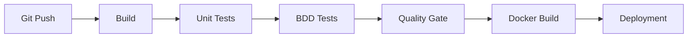
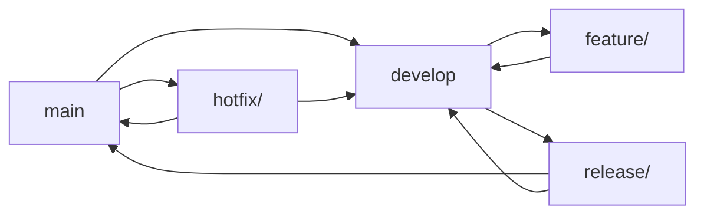

# 🏥 MedHead - Hospital Bed Allocation System

[](https://github.com/medhead/poc)
[](https://openjdk.java.net/)
[](https://spring.io/projects/spring-boot)
[](LICENSE)

## 📋 Table of Contents

- [Overview](#-overview)
- [Architecture](#-architecture)
- [Prerequisites](#-prerequisites)
- [Installation](#-installation)
- [Tests](#-tests)
- [CI/CD Pipeline](#-cicd-pipeline)
- [Git Workflow](#-git-workflow)
- [API Documentation](#-api-documentation)
- [Deployment](#-deployment)
- [Contributing](#-contributing)

## 🎯 Overview

MedHead is an intelligent hospital bed allocation system that recommends the most appropriate facility based on the required medical specialty and the patient's geographic location.

### Key Features

- 🔍 **Intelligent Allocation**: Hospital recommendation based on specialty and geolocation
- 🏥 **Hospital Management**: Catalog of facilities with specialties and availability
- 🔐 **Security**: Authentication and role-based authorization (ADMIN, MEDICAL_STAFF)
- 📊 **Anonymization**: Protection of patient personal data
- 🧪 **BDD Tests**: Cucumber test scenarios for business validation

## 🏗️ Architecture

```
┌─────────────────┐    ┌─────────────────┐    ┌─────────────────┐
│   Frontend      │    │   Backend       │    │   Database      │
│   (React/Vue)   │◄──►│   Spring Boot   │◄──►│   PostgreSQL    │
└─────────────────┘    └─────────────────┘    │   (Prod)        │
                               │               │   H2 (Test)     │
                               │               └─────────────────┘
                               ▼
                      ┌─────────────────┐
                      │   Monitoring    │
                      │   Actuator      │
                      └─────────────────┘
```

### Technical Stack

- **Backend**: Spring Boot 3.5.6, Java 17
- **Database**: PostgreSQL (production), H2 (development/test)
- **Security**: Spring Security with role-based authentication
- **Tests**: JUnit 5, Cucumber (BDD), Maven Surefire
- **Documentation**: Spring Boot Actuator

## ⚙️ Prerequisites

- **Java**: OpenJDK 17 or higher
- **Maven**: 3.6+ (or use the included wrapper `./mvnw`)
- **Database**: PostgreSQL 12+ (for production)
- **Tools**: Git, IDE (IntelliJ IDEA, Eclipse, VS Code)

## 🚀 Installation

### 1. Clone the repository

```bash
git clone https://github.com/medhead/poc.git
cd medhead
```

### 2. Database configuration

#### Development (H2 - automatic)
```bash
# No configuration required, H2 starts automatically
```

#### Production (PostgreSQL)
```bash
# Create the database
createdb medhead_prod

# Configure environment variables
export SPRING_DATASOURCE_URL=jdbc:postgresql://localhost:5432/medhead_prod
export SPRING_DATASOURCE_USERNAME=your_username
export SPRING_DATASOURCE_PASSWORD=your_password
```

### 3. Compilation and startup

```bash
cd backend

# Compilation
./mvnw clean compile

# Start in development mode
./mvnw spring-boot:run -Dspring-boot.run.profiles=dev

# Or start with JAR
./mvnw clean package
java -jar target/poc-0.0.1-SNAPSHOT.jar --spring.profiles.active=dev
```

The application will be accessible at: `http://localhost:8080`

## 🧪 Tests

### Test structure

```
src/test/java/com/medhead/poc/
├── PocApplicationTests.java          # Spring Boot unit tests
├── TestSuite.java                    # Test suite
└── bdd/
    ├── runners/
    │   └── CucumberBddTest.java      # Cucumber BDD tests
    └── steps/
        ├── AllocationSteps.java      # Allocation steps
        ├── PerformanceSteps.java     # Performance tests
        └── ...                       # Other BDD steps
```

### Test execution

#### Unit tests (recommended)
```bash
# Unit tests only
./mvnw test

# Or with the optimized script
./run-tests.sh unit
```

#### Cucumber BDD tests
```bash
# BDD tests separately
./mvnw test -Pbdd-tests

# Or with the script
./run-tests.sh bdd
```

#### All tests
```bash
# Complete tests
./mvnw clean test

# Or with the script
./run-tests.sh all
```

### Available test scripts

| Command | Description |
|----------|-------------|
| `./run-tests.sh unit` | Unit tests only |
| `./run-tests.sh bdd` | Cucumber BDD tests |
| `./run-tests.sh all` | All tests |
| `./run-tests.sh clean` | Test files cleanup |

### Test types

#### Unit tests
- ✅ Spring Boot integration tests
- ✅ Application context validation
- ✅ H2 configuration tests

#### BDD tests (Behavior Driven Development)
- 🎭 **CI/CD Validation**: Automated pipeline
- 🎭 **Hospital Allocation**: Business scenarios
- 🎭 **Performance**: Simulated load tests
- 🎭 **Security**: Compliance and anonymization
- 🎭 **Availability**: Bed management

### Test configuration

```properties
# application-dev.properties
spring.datasource.url=jdbc:h2:mem:testdb
spring.jpa.hibernate.ddl-auto=create-drop
spring.jpa.show-sql=true
```

## 🔄 CI/CD Pipeline

### Pipeline overview



### Pipeline stages

#### 1. **Build** (`mvn clean compile`)
- Source code compilation
- Dependency resolution
- Syntax validation

#### 2. **Unit Tests** (`mvn test`)
- JUnit test execution
- Spring Boot context validation
- H2 integration tests

#### 3. **BDD Tests** (`mvn test -Pbdd-tests`)
- Business scenario validation
- Simulated performance tests
- Compliance verification

#### 4. **Quality Gate**
- Code coverage (minimum 80%)
- Static analysis (SonarQube)
- Security validation

#### 5. **Docker Build**
- Docker image creation
- Push to registry
- Deployment preparation

#### 6. **Deployment**
- Test environment deployment
- Regression tests
- Production deployment (if validated)

### CI/CD Configuration

#### GitHub Actions (example)
```yaml
name: CI/CD Pipeline

on:
  push:
    branches: [ main, develop ]
  pull_request:
    branches: [ main ]

jobs:
  test:
    runs-on: ubuntu-latest
    steps:
    - uses: actions/checkout@v3
    - name: Set up JDK 17
      uses: actions/setup-java@v3
      with:
        java-version: '17'
    - name: Run tests
      run: ./mvnw test
    - name: Run BDD tests
      run: ./mvnw test -Pbdd-tests
```

### Metrics and reports

- **Code coverage**: Generated in `target/site/jacoco/`
- **BDD reports**: Available in `target/cucumber-reports/`
- **Build logs**: Accessible via CI/CD interface

## 🌿 Git Workflow

### Branching strategy (Git Flow)



### Branch types

#### Main branches
- **`main`**: Production branch, stable code
- **`develop`**: Development branch, continuous integration

#### Support branches
- **`feature/*`**: New features
- **`release/*`**: Version preparation
- **`hotfix/*`**: Urgent production fixes

### Detailed workflow

#### 1. **Feature development**

```bash
# Create a feature branch from develop
git checkout develop
git pull origin develop
git checkout -b feature/allocation-algorithm

# Develop the feature
git add .
git commit -m "feat: implement advanced allocation algorithm"

# Push and create a Pull Request
git push origin feature/allocation-algorithm
```

#### 2. **Pull Request process**

```bash
# PR title: [TYPE] Short description
# Example: [FEAT] Advanced hospital allocation algorithm

# PR description (template):
## 🎯 Objective
Describe the feature objective

## 🔧 Changes
- [ ] New feature
- [ ] Bug fix
- [ ] Refactoring
- [ ] Documentation

## 🧪 Tests
- [ ] Unit tests added
- [ ] BDD tests updated
- [ ] Integration tests validated

## 📋 Checklist
- [ ] Code reviewed
- [ ] Tests pass
- [ ] Documentation updated
- [ ] No conflicts with develop
```

#### 3. **Release process**

```bash
# Create a release branch from develop
git checkout develop
git checkout -b release/v1.2.0

# Finalize the release
git commit -m "chore: prepare release v1.2.0"

# Merge to main and develop
git checkout main
git merge release/v1.2.0
git tag v1.2.0
git checkout develop
git merge release/v1.2.0

# Delete the release branch
git branch -d release/v1.2.0
```

#### 4. **Production hotfix**

```bash
# Create a hotfix branch from main
git checkout main
git checkout -b hotfix/critical-security-fix

# Apply the fix
git commit -m "fix: resolve critical security vulnerability"

# Merge to main and develop
git checkout main
git merge hotfix/critical-security-fix
git tag v1.2.1
git checkout develop
git merge hotfix/critical-security-fix
```

### Commit conventions

#### Message format
```
<type>(<scope>): <description>

[optional body]

[optional footer]
```

#### Commit types
- **`feat`**: New feature
- **`fix`**: Bug fix
- **`docs`**: Documentation
- **`style`**: Formatting, no code change
- **`refactor`**: Refactoring
- **`test`**: Adding tests
- **`chore`**: Maintenance tasks

#### Examples
```bash
feat(allocation): add geolocation-based hospital recommendation
fix(security): resolve patient data anonymization issue
docs(api): update allocation endpoint documentation
test(bdd): add performance test scenarios
chore(deps): update Spring Boot to 3.5.6
```

### Branch protection

#### `main` branch
- ✅ Requires a Pull Request
- ✅ Requires review from at least 1 senior developer
- ✅ Requires all tests to pass
- ✅ Requires "up-to-date" status with `develop`

#### `develop` branch
- ✅ Requires a Pull Request
- ✅ Requires review from at least 1 developer
- ✅ Requires all tests to pass

### Quality tools

#### Pre-commit hooks
```bash
# Install hooks
npm install -g husky lint-staged

# Configuration in package.json
{
  "husky": {
    "hooks": {
      "pre-commit": "lint-staged"
    }
  }
}
```

#### Automatic validation
- **SonarQube**: Code quality analysis
- **CodeClimate**: Complexity metrics
- **Dependabot**: Automatic dependency updates

## 📚 API Documentation

### Main endpoints

#### Hospital allocation
```http
POST /api/allocate
Content-Type: application/json

{
  "specialty": "Cardiology",
  "latitude": 51.5009,
  "longitude": -0.1253
}
```

#### Health Check
```http
GET /api/health
```

#### Patient management (authentication required)
```http
GET /api/patients/statistics
Authorization: Bearer <token>
```

### Postman Collection

A complete Postman collection is available: `MedHead_API_Collection.postman_collection.json`

```bash
# Import into Postman
# File > Import > Select Files > MedHead_API_Collection.postman_collection.json
```

### Interactive documentation

- **Swagger UI**: `http://localhost:8080/swagger-ui.html`
- **Actuator**: `http://localhost:8080/actuator`

## 🚀 Deployment

### Environments

| Environment | URL | Database | Profile |
|---------------|-----|-----------------|---------|
| Development | `http://localhost:8080` | H2 (memory) | `dev` |
| Test | `https://medhead-test.example.com` | PostgreSQL | `test` |
| Production | `https://medhead.example.com` | PostgreSQL | `prod` |

### Docker configuration

```dockerfile
FROM openjdk:17-jdk-slim

COPY target/poc-0.0.1-SNAPSHOT.jar app.jar

EXPOSE 8080

ENTRYPOINT ["java", "-jar", "/app.jar"]
```

### Environment variables

```bash
# Production
SPRING_PROFILES_ACTIVE=prod
SPRING_DATASOURCE_URL=jdbc:postgresql://db:5432/medhead
SPRING_DATASOURCE_USERNAME=medhead_user
SPRING_DATASOURCE_PASSWORD=secure_password
```

## 🤝 Contributing

### How to contribute

1. **Fork** the repository
2. **Create** a feature branch (`git checkout -b feature/amazing-feature`)
3. **Commit** your changes (`git commit -m 'feat: add amazing feature'`)
4. **Push** to the branch (`git push origin feature/amazing-feature`)
5. **Open** a Pull Request

### Code standards

- **Java**: Follow Oracle conventions
- **Tests**: Minimum 80% coverage
- **Documentation**: JavaDoc for public methods
- **Commits**: Messages in English, conventional commits format

### Code Review

- ✅ Unit and BDD tests pass
- ✅ Code reviewed by at least 1 developer
- ✅ No duplicated code
- ✅ Documentation updated
- ✅ No security vulnerabilities

## 📞 Support

- **Issues**: [GitHub Issues](https://github.com/medhead/poc/issues)
- **Documentation**: [Project Wiki](https://github.com/medhead/poc/wiki)
- **Email**: dev-team@medhead.com

## 📄 License

This project is licensed under MIT. See the [LICENSE](LICENSE) file for more details.

---

**🏥 MedHead** - Optimize hospital bed allocation to save lives