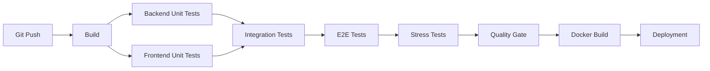
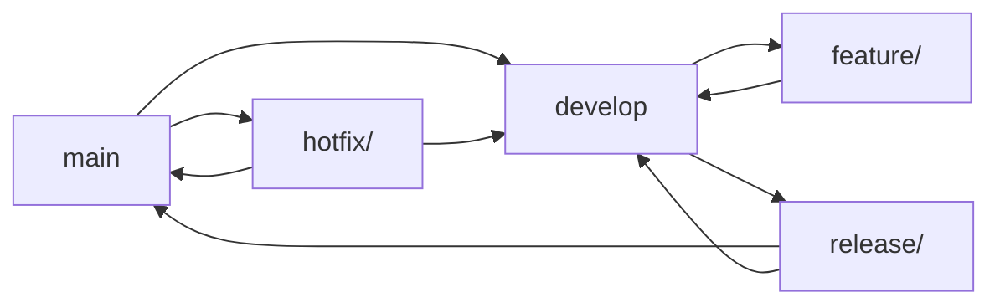

# 🏥 MedHead - Hospital Bed Allocation System

[](https://github.com/medhead/poc)
[](https://openjdk.java.net/)
[](https://spring.io/projects/spring-boot)
[](https://angular.io/)
[](https://nodejs.org/)
[](https://docker.com/)
[](LICENSE)

## 📋 Table of Contents

- [Overview](#-overview)
- [Architecture](#-architecture)
- [Prerequisites](#-prerequisites)
- [Quick Start with Docker](#-quick-start-with-docker)
- [Manual Installation](#-manual-installation)
- [Testing Pyramid](#-testing-pyramid)
- [Frontend Application](#-frontend-application)
- [CI/CD Pipeline](#-cicd-pipeline)
- [Git Workflow](#-git-workflow)
- [API Documentation](#-api-documentation)
- [Deployment](#-deployment)
- [Contributing](#-contributing)

## 🎯 Overview

MedHead is an intelligent hospital bed allocation system that recommends the most appropriate facility based on the required medical specialty and the patient's geographic location.

### Key Features

- 🔍 **Intelligent Allocation**: Hospital recommendation based on specialty and geolocation
- 🎨 **Modern Frontend**: Angular 16 application with responsive design
- 🏥 **Hospital Management**: Catalog of facilities with specialties and availability
- 🌐 **Geocoding Integration**: Automatic address-to-coordinates conversion
- 🔐 **Security**: Authentication and role-based authorization (ADMIN, MEDICAL_STAFF)
- 📊 **Anonymization**: Protection of patient personal data with GDPR compliance
- 🧪 **Complete Testing Pyramid**: Unit, Integration, E2E, and Stress tests
- 🐳 **Docker Ready**: Full containerization with Docker Compose
- 📱 **Mobile Responsive**: Optimized for all devices and screen sizes

## 🏗️ Architecture

```
┌─────────────────┐    ┌─────────────────┐    ┌─────────────────┐
│   Frontend      │    │   Backend       │    │   Database      │
│   Angular 16    │◄──►│   Spring Boot   │◄──►│   PostgreSQL    │
│   (Port 4200)   │    │   (Port 8080)   │    │   (Port 5433)   │
└─────────────────┘    └─────────────────┘    └─────────────────┘
         │                       │                       │
         │                       │                       │
         ▼                       ▼                       ▼
┌─────────────────┐    ┌─────────────────┐    ┌─────────────────┐
│   Nginx Proxy   │    │   Monitoring    │    │   pgAdmin       │
│   (Port 80)     │    │   Actuator      │    │   (Port 8082)   │
└─────────────────┘    └─────────────────┘    └─────────────────┘
```

### Docker Architecture

```
┌─────────────────────────────────────────────────────────────────┐
│                     Docker Compose Stack                       │
├─────────────────┬─────────────────┬─────────────────────────────┤
│   Frontend      │   Backend       │   Database Services        │
│   Container     │   Container     │                             │
│   ├─ Angular    │   ├─ Spring Boot│   ├─ PostgreSQL (5433)     │
│   ├─ Nginx      │   ├─ Actuator   │   ├─ pgAdmin (8082)        │
│   └─ Port 4200  │   └─ Port 8080  │   └─ Data Persistence      │
└─────────────────┴─────────────────┴─────────────────────────────┘
```

### Technical Stack

- **Frontend**: Angular 16.2.12, TypeScript, CSS3
- **Backend**: Spring Boot 3.5.6, Java 17
- **Database**: PostgreSQL (production), H2 (development/test)
- **Security**: Spring Security with role-based authentication
- **Testing**: JUnit 5, Mockito, AssertJ, Cypress (E2E), K6/JMeter (Stress)
- **DevOps**: Docker, Docker Compose, Maven, npm
- **Documentation**: Spring Boot Actuator, Swagger UI
- **Geocoding**: Nominatim OpenStreetMap API

## ⚙️ Prerequisites

### For Docker Setup (Recommended)
- **Docker**: 20.10+ with Docker Compose
- **Git**: For cloning the repository

### For Manual Setup
- **Java**: OpenJDK 17 or higher
- **Maven**: 3.6+ (or use the included wrapper `./mvnw`)
- **Node.js**: 18+ with npm 9+
- **Angular CLI**: 16.2.16+
- **Database**: PostgreSQL 12+ (for production)
- **Tools**: Git, IDE (IntelliJ IDEA, Eclipse, VS Code)

## 🚀 Quick Start with Docker

### 1. Clone and Start Everything

```bash
git clone https://github.com/medhead/poc.git
cd medhead

# Start the complete application stack
cd docker
chmod +x start-medhead.sh
./start-medhead.sh
```

### 2. Access the Applications

Once started, access the applications at:

- **🎨 Frontend Angular**: http://localhost:4200
- **🔧 Backend API**: http://localhost:8080
- **📊 PostgreSQL DB**: localhost:5433
- **🛠️ pgAdmin**: http://localhost:8082

### 3. Test the Application

```bash
# Test API health
curl http://localhost:8080/api/health

# Test frontend
curl http://localhost:4200
```

### 4. Stop the Application

```bash
cd docker
docker-compose down
```

## 🔧 Manual Installation

### 1. Clone the repository

```bash
git clone https://github.com/medhead/poc.git
cd medhead
```

### 2. Backend Setup

```bash
cd backend

# Compilation
./mvnw clean compile

# Start in development mode
./mvnw spring-boot:run -Dspring-boot.run.profiles=dev

# Or start with JAR
./mvnw clean package
java -jar target/poc-0.0.1-SNAPSHOT.jar --spring.profiles.active=dev
```

### 3. Frontend Setup

```bash
cd frontend

# Install dependencies
npm install

# Start development server
npm start
```

### 4. Database Configuration

#### Development (H2 - automatic)
```bash
# No configuration required, H2 starts automatically
```

#### Production (PostgreSQL)
```bash
# Create the database
createdb medhead_prod

# Configure environment variables
export SPRING_DATASOURCE_URL=jdbc:postgresql://localhost:5432/medhead_prod
export SPRING_DATASOURCE_USERNAME=your_username
export SPRING_DATASOURCE_PASSWORD=your_password
```

The applications will be accessible at:
- **Backend API**: http://localhost:8080
- **Frontend**: http://localhost:4200

## 🧪 Testing Pyramid

MedHead implements a comprehensive testing pyramid ensuring quality, reliability, and performance at all levels.

### Test Structure Overview

```
                    ┌─────────────────────────┐
                    │    E2E Tests (Cypress)  │  ← Top Layer
                    │    • UI Integration     │
                    │    • User Journeys      │
                    │    • Cross-browser      │
                    └─────────────────────────┘
                           ▲
                    ┌─────────────────────────┐
                    │  Integration Tests      │  ← Middle Layer
                    │  • API Endpoints        │
                    │  • Database Integration │
                    │  • Service Layer        │
                    └─────────────────────────┘
                           ▲
                    ┌─────────────────────────┐
                    │    Unit Tests           │  ← Foundation
                    │    • Service Logic      │
                    │    • Component Tests    │
                    │    • Business Rules     │
                    └─────────────────────────┘
                           ▲
                    ┌─────────────────────────┐
                    │    Stress Tests         │  ← Production Readiness
                    │    • Load Testing       │
                    │    • Performance        │
                    │    • Scalability        │
                    └─────────────────────────┘
```

### Comprehensive Test Suite

#### 1. **Unit Tests** (Foundation)
- **Backend**: JUnit 5, Mockito, AssertJ
- **Frontend**: Angular Testing Utilities
- **Coverage**: Business logic, services, components

#### 2. **Integration Tests** (Middle Layer)
- **API Testing**: MockMvc, Spring Boot Test
- **Database Integration**: H2 for testing
- **Service Integration**: Cross-component validation

#### 3. **End-to-End Tests** (Top Layer)
- **Cypress**: UI automation and user journey validation
- **Cross-browser**: Chrome, Firefox, Edge compatibility
- **Performance**: Frontend performance monitoring

#### 4. **Stress & Load Tests** (Production Readiness)
- **K6**: Performance and load testing
- **JMeter**: Stress testing scenarios
- **Custom Scripts**: API load validation

### Running Tests

#### Quick Test Execution
```bash
# Run complete test suite
cd scripts
chmod +x run-all-tests.sh
./run-all-tests.sh
```

#### Individual Test Types
```bash
# Backend Unit Tests
cd backend
./mvnw test

# Frontend Unit Tests
cd frontend
npm test

# E2E Tests
cd frontend
npm run cy:run

# Stress Tests (K6)
cd scripts
./run-k6-tests.sh

# Integration Tests
cd backend
./mvnw test -Dtest="*IntegrationTest"
```

### Test Reports

All test results are generated in the `reports/` directory:

```
reports/
├── backend/
│   ├── unit/           # Unit test reports
│   ├── integration/    # Integration test reports
│   └── stress/         # Stress test reports
├── frontend/
│   ├── unit/           # Angular unit tests
│   ├── e2e/            # Cypress reports
│   └── performance/    # Performance metrics
├── stress/
│   ├── jmeter/         # JMeter reports
│   ├── k6/             # K6 performance reports
│   └── curl/           # Custom stress test results
└── index.html          # Consolidated test dashboard
```

### Test Configuration

#### Backend Test Profile
```properties
# application-test.properties
spring.datasource.url=jdbc:h2:mem:testdb;DB_CLOSE_DELAY=-1
spring.jpa.hibernate.ddl-auto=create-drop
spring.jpa.show-sql=true
```

#### Frontend Test Configuration
```json
// cypress.config.js
{
  "baseUrl": "http://localhost:4200",
  "viewportWidth": 1280,
  "viewportHeight": 720,
  "video": true,
  "screenshots": true
}
```

## 🎨 Frontend Application

The MedHead frontend is a modern Angular 16 application that provides an intuitive interface for hospital bed allocation.

### Features

- **🌐 Automatic Geocoding**: Converts addresses to coordinates via OpenStreetMap
- **🏥 Specialty Selection**: Choose from 16 medical specialties
- **📍 Location Input**: Enter any address for hospital recommendation
- **📱 Responsive Design**: Works on desktop, tablet, and mobile
- **⚡ Real-time Validation**: Instant feedback on form inputs
- **🎯 Smart Results**: Displays hospital details, distance, and availability

### Frontend Architecture

```
frontend/
├── src/
│   ├── app/
│   │   ├── components/
│   │   │   └── hospital-allocation.component.*  # Main component
│   │   ├── services/
│   │   │   ├── allocation.service.ts            # Backend API
│   │   │   └── geocoding.service.ts             # Address geocoding
│   │   ├── models/
│   │   │   ├── allocation-request.ts            # Request model
│   │   │   ├── allocation-response.ts           # Response model
│   │   │   └── geocoding-response.ts            # Geocoding model
│   │   └── app.module.ts                        # Angular module
│   ├── styles.css                               # Global styles
│   └── index.html                               # Main HTML
├── cypress/
│   ├── e2e/
│   │   ├── frontend-ui.cy.js                    # UI tests
│   │   └── performance.cy.js                    # Performance tests
│   └── support/
├── package.json                                 # Dependencies
├── angular.json                                 # Angular config
└── tsconfig.json                               # TypeScript config
```

### Available Scripts

| Command | Description |
|---------|-------------|
| `npm start` | Start development server |
| `npm build` | Build for production |
| `npm test` | Run unit tests |
| `npm run cy:open` | Open Cypress test runner |
| `npm run cy:run` | Run E2E tests |

### User Workflow

1. **Select Specialty**: Choose from 16 medical specialties
2. **Enter Location**: Type any address or location
3. **Automatic Geocoding**: System converts address to coordinates
4. **Hospital Search**: Backend finds nearest available hospital
5. **View Results**: See hospital details, distance, and availability

### Integration with Backend

The frontend seamlessly integrates with the Spring Boot backend:

- **API Endpoints**: `/api/allocate`, `/api/health`
- **Error Handling**: Comprehensive error management
- **Loading States**: Visual feedback during operations
- **Data Validation**: Client-side and server-side validation

## 🔄 CI/CD Pipeline

### Pipeline overview



### Pipeline stages

#### 1. **Build** (`mvn clean compile` + `npm install`)
- Backend source code compilation
- Frontend dependency resolution
- Syntax validation for both stacks

#### 2. **Unit Tests** (Parallel execution)
- **Backend**: JUnit test execution (`mvn test`)
- **Frontend**: Angular unit tests (`npm test`)
- Spring Boot context validation
- Component and service testing

#### 3. **Integration Tests**
- API endpoint validation
- Database integration tests
- Service layer integration
- Cross-component communication

#### 4. **E2E Tests** (`npm run cy:run`)
- UI automation with Cypress
- User journey validation
- Cross-browser compatibility
- Frontend performance monitoring

#### 5. **Stress Tests** (K6/JMeter)
- Load testing scenarios
- Performance benchmarking
- Scalability validation
- Production readiness assessment

#### 6. **Quality Gate**
- Code coverage (minimum 80%)
- Static analysis (SonarQube)
- Security validation
- Performance metrics

#### 7. **Docker Build**
- Multi-stage Docker images
- Frontend and backend containers
- Push to registry
- Deployment preparation

#### 8. **Deployment**
- Docker Compose stack deployment
- Health checks validation
- Smoke tests
- Production deployment (if validated)

### CI/CD Configuration

#### GitHub Actions (example)
```yaml
name: MedHead CI/CD Pipeline

on:
  push:
    branches: [ main, develop ]
  pull_request:
    branches: [ main ]

jobs:
  backend-tests:
    runs-on: ubuntu-latest
    steps:
    - uses: actions/checkout@v3
    - name: Set up JDK 17
      uses: actions/setup-java@v3
      with:
        java-version: '17'
    - name: Cache Maven dependencies
      uses: actions/cache@v3
      with:
        path: ~/.m2
        key: ${{ runner.os }}-m2-${{ hashFiles('**/pom.xml') }}
    - name: Run backend tests
      run: |
        cd backend
        ./mvnw test
        ./mvnw test -Dtest="*IntegrationTest"
    - name: Run stress tests
      run: |
        cd scripts
        chmod +x run-all-tests.sh
        ./run-all-tests.sh

  frontend-tests:
    runs-on: ubuntu-latest
    steps:
    - uses: actions/checkout@v3
    - name: Set up Node.js
      uses: actions/setup-node@v3
      with:
        node-version: '18'
        cache: 'npm'
        cache-dependency-path: frontend/package-lock.json
    - name: Install dependencies
      run: |
        cd frontend
        npm ci
    - name: Run frontend tests
      run: |
        cd frontend
        npm test -- --watch=false
        npm run cy:run

  docker-build:
    needs: [backend-tests, frontend-tests]
    runs-on: ubuntu-latest
    steps:
    - uses: actions/checkout@v3
    - name: Build Docker images
      run: |
        cd docker
        docker-compose build
    - name: Test Docker stack
      run: |
        cd docker
        docker-compose up -d
        sleep 30
        curl -f http://localhost:8080/api/health
        curl -f http://localhost:4200
        docker-compose down
```

### Metrics and reports

- **Backend coverage**: Generated in `backend/target/site/jacoco/`
- **Frontend coverage**: Available in `frontend/coverage/`
- **E2E reports**: Cypress reports in `frontend/cypress/reports/`
- **Stress test reports**: K6/JMeter results in `reports/stress/`
- **Consolidated dashboard**: `reports/index.html`
- **Build logs**: Accessible via CI/CD interface

## 🌿 Git Workflow

### Branching strategy (Git Flow)



### Branch types

#### Main branches
- **`main`**: Production branch, stable code
- **`develop`**: Development branch, continuous integration

#### Support branches
- **`feature/*`**: New features
- **`release/*`**: Version preparation
- **`hotfix/*`**: Urgent production fixes

### Detailed workflow

#### 1. **Feature development**

```bash
# Create a feature branch from develop
git checkout develop
git pull origin develop
git checkout -b feature/allocation-algorithm

# Develop the feature
git add .
git commit -m "feat: implement advanced allocation algorithm"

# Push and create a Pull Request
git push origin feature/allocation-algorithm
```

#### 2. **Pull Request process**

```bash
# PR title: [TYPE] Short description
# Example: [FEAT] Advanced hospital allocation algorithm

# PR description (template):
## 🎯 Objective
Describe the feature objective

## 🔧 Changes
- [ ] New feature
- [ ] Bug fix
- [ ] Refactoring
- [ ] Documentation

## 🧪 Tests
- [ ] Unit tests added
- [ ] BDD tests updated
- [ ] Integration tests validated

## 📋 Checklist
- [ ] Code reviewed
- [ ] Tests pass
- [ ] Documentation updated
- [ ] No conflicts with develop
```

#### 3. **Release process**

```bash
# Create a release branch from develop
git checkout develop
git checkout -b release/v1.2.0

# Finalize the release
git commit -m "chore: prepare release v1.2.0"

# Merge to main and develop
git checkout main
git merge release/v1.2.0
git tag v1.2.0
git checkout develop
git merge release/v1.2.0

# Delete the release branch
git branch -d release/v1.2.0
```

#### 4. **Production hotfix**

```bash
# Create a hotfix branch from main
git checkout main
git checkout -b hotfix/critical-security-fix

# Apply the fix
git commit -m "fix: resolve critical security vulnerability"

# Merge to main and develop
git checkout main
git merge hotfix/critical-security-fix
git tag v1.2.1
git checkout develop
git merge hotfix/critical-security-fix
```

### Commit conventions

#### Message format
```
<type>(<scope>): <description>

[optional body]

[optional footer]
```

#### Commit types
- **`feat`**: New feature
- **`fix`**: Bug fix
- **`docs`**: Documentation
- **`style`**: Formatting, no code change
- **`refactor`**: Refactoring
- **`test`**: Adding tests
- **`chore`**: Maintenance tasks

#### Examples
```bash
feat(allocation): add geolocation-based hospital recommendation
fix(security): resolve patient data anonymization issue
docs(api): update allocation endpoint documentation
test(bdd): add performance test scenarios
chore(deps): update Spring Boot to 3.5.6
```

### Branch protection

#### `main` branch
- ✅ Requires a Pull Request
- ✅ Requires review from at least 1 senior developer
- ✅ Requires all tests to pass
- ✅ Requires "up-to-date" status with `develop`

#### `develop` branch
- ✅ Requires a Pull Request
- ✅ Requires review from at least 1 developer
- ✅ Requires all tests to pass

### Quality tools

#### Pre-commit hooks
```bash
# Install hooks
npm install -g husky lint-staged

# Configuration in package.json
{
  "husky": {
    "hooks": {
      "pre-commit": "lint-staged"
    }
  }
}
```

#### Automatic validation
- **SonarQube**: Code quality analysis
- **CodeClimate**: Complexity metrics
- **Dependabot**: Automatic dependency updates

## 📚 API Documentation

### Main endpoints

#### Hospital allocation
```http
POST /api/allocate
Content-Type: application/json

{
  "specialty": "Cardiology",
  "latitude": 51.5009,
  "longitude": -0.1253
}
```

#### Health Check
```http
GET /api/health
```

#### Patient management (authentication required)
```http
GET /api/patients/statistics
Authorization: Bearer <token>
```

### Postman Collection

A complete Postman collection is available: `MedHead_API_Collection.postman_collection.json`

```bash
# Import into Postman
# File > Import > Select Files > MedHead_API_Collection.postman_collection.json
```

### Interactive documentation

- **Swagger UI**: `http://localhost:8080/swagger-ui.html`
- **Actuator**: `http://localhost:8080/actuator`

## 🚀 Deployment

### Environments

| Environment | Frontend URL | Backend URL | Database | Profile |
|-------------|--------------|-------------|----------|---------|
| Development | `http://localhost:4200` | `http://localhost:8080` | H2 (memory) | `dev` |
| Docker | `http://localhost:4200` | `http://localhost:8080` | PostgreSQL | `docker` |
| Test | `https://medhead-test.example.com` | `https://api-test.medhead.com` | PostgreSQL | `test` |
| Production | `https://medhead.example.com` | `https://api.medhead.com` | PostgreSQL | `prod` |

### Docker Deployment (Recommended)

#### Quick Start
```bash
# Clone and start everything
git clone https://github.com/medhead/poc.git
cd medhead/docker
chmod +x start-medhead.sh
./start-medhead.sh
```

#### Docker Compose Services
```yaml
# docker-compose.yml
services:
  frontend:
    build: ../frontend
    ports: ["4200:80"]
    
  backend:
    build: ../backend
    ports: ["8080:8080"]
    
  postgres:
    image: postgres:15-alpine
    ports: ["5433:5432"]
    
  pgadmin:
    image: dpage/pgadmin4:latest
    ports: ["8082:80"]
```

#### Docker Commands
```bash
# Build all services
docker-compose build

# Start all services
docker-compose up -d

# View logs
docker-compose logs -f

# Stop all services
docker-compose down

# Clean up volumes
docker-compose down -v
```

### Manual Deployment

#### Backend Deployment
```dockerfile
# Backend Dockerfile
FROM maven:3.8.4-openjdk-17 AS build
WORKDIR /app
COPY pom.xml .
COPY src src
RUN mvn clean package -DskipTests

FROM openjdk:17-jdk-slim
WORKDIR /app
COPY --from=build /app/target/*.jar app.jar
EXPOSE 8080
ENTRYPOINT ["java", "-jar", "app.jar"]
```

#### Frontend Deployment
```dockerfile
# Frontend Dockerfile
FROM node:18-alpine AS build
WORKDIR /app
COPY package*.json ./
RUN npm ci
COPY . .
RUN npm run build

FROM nginx:alpine
COPY --from=build /app/dist/medhead-frontend /usr/share/nginx/html
COPY nginx.conf /etc/nginx/nginx.conf
EXPOSE 80
```

### Environment Variables

#### Production Configuration
```bash
# Backend
SPRING_PROFILES_ACTIVE=prod
SPRING_DATASOURCE_URL=jdbc:postgresql://db:5432/medhead
SPRING_DATASOURCE_USERNAME=medhead_user
SPRING_DATASOURCE_PASSWORD=secure_password

# Frontend
NODE_ENV=production
API_BASE_URL=https://api.medhead.com
```

#### Docker Configuration
```bash
# Docker environment
SPRING_PROFILES_ACTIVE=docker
SPRING_DATASOURCE_URL=jdbc:postgresql://postgres:5432/medhead_db
SPRING_DATASOURCE_USERNAME=medhead_user
SPRING_DATASOURCE_PASSWORD=medhead_password
```

## 🤝 Contributing

### How to contribute

1. **Fork** the repository
2. **Create** a feature branch (`git checkout -b feature/amazing-feature`)
3. **Commit** your changes (`git commit -m 'feat: add amazing feature'`)
4. **Push** to the branch (`git push origin feature/amazing-feature`)
5. **Open** a Pull Request

### Code standards

- **Backend (Java)**: Follow Oracle conventions and Spring Boot best practices
- **Frontend (TypeScript)**: Follow Angular style guide and ESLint rules
- **Tests**: Minimum 80% coverage for both backend and frontend
- **Documentation**: JavaDoc for public methods, JSDoc for TypeScript
- **Commits**: Messages in English, conventional commits format
- **Translation**: All user-facing text in English

### Code Review

- ✅ Unit, Integration, and E2E tests pass
- ✅ Code reviewed by at least 1 developer
- ✅ No duplicated code
- ✅ Documentation updated
- ✅ No security vulnerabilities
- ✅ Frontend responsive design validated
- ✅ Docker builds successfully
- ✅ Performance tests within acceptable limits

## 📞 Support

- **Issues**: [GitHub Issues](https://github.com/medhead/poc/issues)
- **Documentation**: [Project Wiki](https://github.com/medhead/poc/wiki)
- **Email**: dev-team@medhead.com

## 📄 License

This project is licensed under MIT. See the [LICENSE](LICENSE) file for more details.

---

**🏥 MedHead** - Optimize hospital bed allocation to save lives