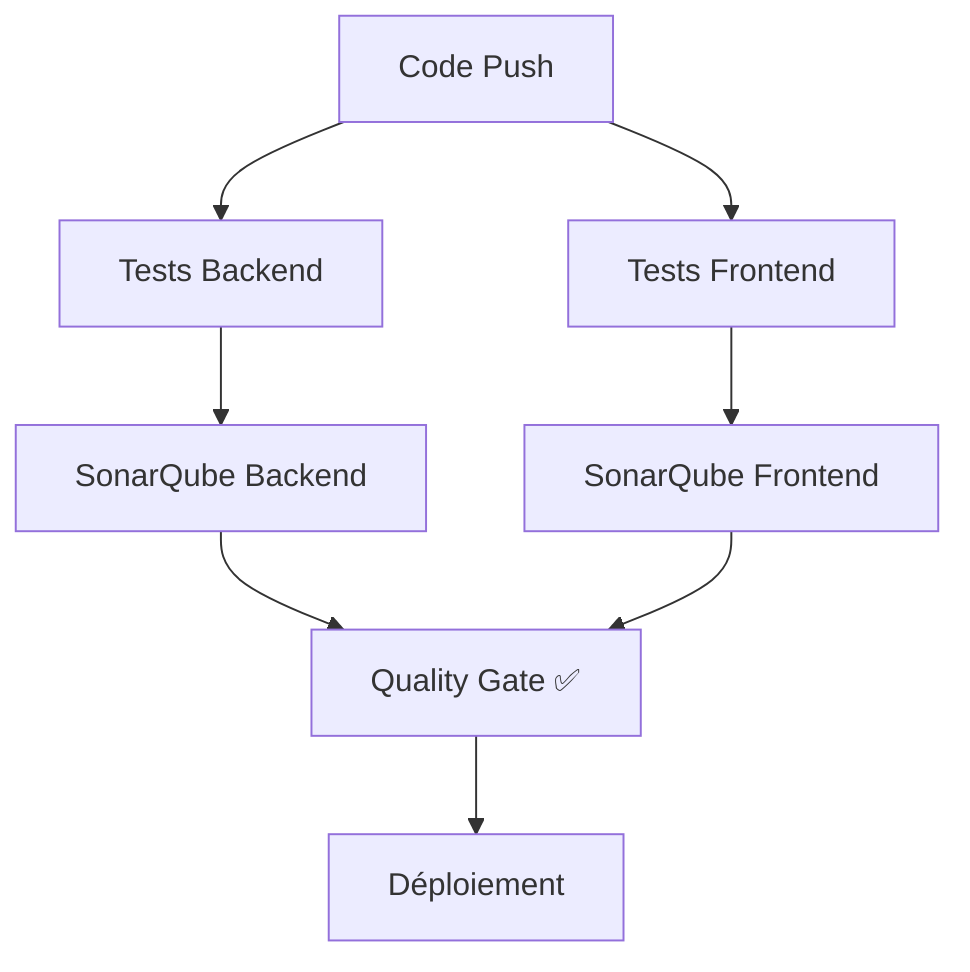
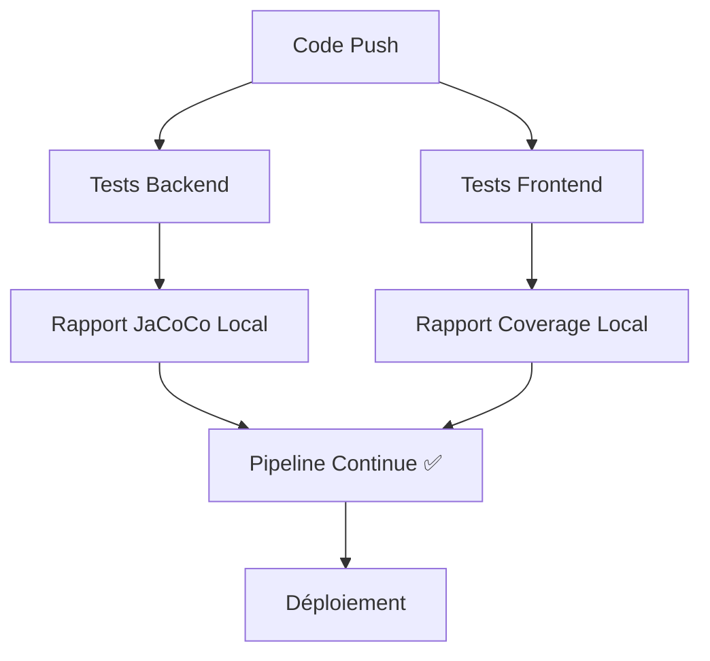

# 🔍 Configuration SonarQube pour MedHead

## 📋 Vue d'ensemble

SonarQube est un outil d'analyse de qualité de code qui permet de détecter les bugs, vulnérabilités et problèmes de qualité dans votre code. Ce guide vous explique comment configurer SonarQube pour le projet MedHead.

## 🚀 Options de Configuration

### Option 1: SonarQube Cloud (Recommandé pour les débutants)

1. **Créer un compte SonarCloud**
   - Aller sur [sonarcloud.io](https://sonarcloud.io)
   - Se connecter avec votre compte GitHub
   - Créer une nouvelle organisation

2. **Configurer le projet**
   - Importer le repository GitHub `medhead`
   - SonarCloud détectera automatiquement les langages (Java, TypeScript)

3. **Récupérer les tokens**
   - Aller dans **Account** → **Security**
   - Générer un nouveau token pour le projet
   - Copier l'URL de votre organisation

### Option 2: SonarQube Self-Hosted

1. **Installer SonarQube**
   ```bash
   # Avec Docker (recommandé)
   docker run -d --name sonarqube \
     -p 9000:9000 \
     -e SONAR_ES_BOOTSTRAP_CHECKS_DISABLE=true \
     sonarqube:latest
   ```

2. **Configuration initiale**
   - Aller sur `http://localhost:9000`
   - Login par défaut: `admin/admin`
   - Changer le mot de passe

## 🔧 Configuration GitHub Secrets

Une fois SonarQube configuré, ajoutez ces secrets dans GitHub :

### Dans GitHub Repository Settings

1. Aller dans **Settings** → **Secrets and variables** → **Actions**
2. Ajouter les secrets suivants :

| **Secret** | **Description** | **Exemple** |
|------------|-----------------|-------------|
| `SONAR_HOST_URL` | URL de votre instance SonarQube | `https://sonarcloud.io` ou `http://localhost:9000` |
| `SONAR_TOKEN` | Token d'authentification | `squ_xxxxxxxxxxxxxxxxxxxxxxxxxxxxxxxx` |

### Configuration SonarCloud

```bash
# Pour SonarCloud
SONAR_HOST_URL=https://sonarcloud.io
SONAR_TOKEN=squ_xxxxxxxxxxxxxxxxxxxxxxxxxxxxxxxx
```

### Configuration SonarQube Self-Hosted

```bash
# Pour SonarQube local
SONAR_HOST_URL=http://localhost:9000
SONAR_TOKEN=your_generated_token
```

## 📁 Configuration des Fichiers

### Backend (Java/Spring Boot)

Le fichier `backend/pom.xml` contient déjà la configuration SonarQube :

```xml
<plugin>
    <groupId>org.sonarsource.scanner.maven</groupId>
    <artifactId>sonar-maven-plugin</artifactId>
    <version>4.0.0.4121</version>
</plugin>
```

### Frontend (Angular/TypeScript)

Créer un fichier `frontend/sonar-project.properties` :

```properties
# Configuration SonarQube pour le frontend
sonar.projectKey=medhead-frontend
sonar.organization=medhead
sonar.host.url=${env.SONAR_HOST_URL}
sonar.login=${env.SONAR_TOKEN}

# Sources
sonar.sources=src
sonar.exclusions=**/node_modules/**,**/dist/**,**/coverage/**,**/*.spec.ts

# Tests
sonar.tests=src
sonar.test.inclusions=**/*.spec.ts

# Couverture
sonar.javascript.lcov.reportPaths=coverage/medhead-frontend/lcov.info
```

## 🔄 Fonctionnement du Pipeline

### Avec SonarQube Configuré



### Sans SonarQube (Mode Fallback)



## 📊 Métriques Analysées

### Backend (Java)
- **Bugs** : Erreurs potentielles
- **Vulnerabilities** : Failles de sécurité
- **Code Smells** : Problèmes de qualité
- **Coverage** : Couverture de tests
- **Duplications** : Code dupliqué

### Frontend (TypeScript)
- **Bugs** : Erreurs TypeScript
- **Vulnerabilities** : Dépendances vulnérables
- **Code Smells** : Problèmes de qualité
- **Coverage** : Couverture de tests
- **Maintainability** : Facilité de maintenance

## 🎯 Seuils de Qualité

Le pipeline utilise les seuils suivants :

| **Métrique** | **Seuil Minimum** | **Objectif** |
|--------------|-------------------|--------------|
| **Coverage** | 70% | 80% |
| **Duplications** | < 3% | < 1% |
| **Maintainability** | A | A |
| **Reliability** | A | A |
| **Security** | A | A |

## 🛠️ Dépannage

### Erreur: "SonarQube server [] can not be reached"

**Cause** : Secrets GitHub non configurés

**Solution** :
1. Vérifier que `SONAR_HOST_URL` et `SONAR_TOKEN` sont configurés
2. Le pipeline continue en mode fallback (rapports locaux)

### Erreur: "Authentication failed"

**Cause** : Token SonarQube invalide

**Solution** :
1. Régénérer le token dans SonarQube
2. Mettre à jour le secret `SONAR_TOKEN` dans GitHub

### Erreur: "Project key already exists"

**Cause** : Clé de projet déjà utilisée

**Solution** :
1. Changer la clé de projet dans les configurations
2. Ou supprimer le projet existant dans SonarQube

## 📈 Avantages de SonarQube

### ✅ Qualité de Code
- Détection automatique des bugs
- Identification des vulnérabilités
- Mesure de la complexité cyclomatique

### ✅ Maintenance
- Identification du code dupliqué
- Suggestions d'amélioration
- Historique des métriques

### ✅ Sécurité
- Scan des dépendances vulnérables
- Détection des failles de sécurité
- Conformité aux standards

### ✅ Collaboration
- Commentaires sur le code
- Assignation des issues
- Intégration avec les PR

## 🚀 Prochaines Étapes

1. **Configurer SonarQube** selon vos besoins
2. **Ajouter les secrets** dans GitHub
3. **Tester le pipeline** avec un push
4. **Analyser les résultats** dans SonarQube
5. **Améliorer la qualité** basée sur les recommandations

## 📚 Ressources Utiles

- [Documentation SonarQube](https://docs.sonarqube.org/)
- [SonarCloud Documentation](https://docs.sonarcloud.io/)
- [Maven SonarQube Plugin](https://docs.sonarqube.org/latest/analysis/scan/sonarscanner-for-maven/)
- [SonarScanner for JavaScript](https://docs.sonarqube.org/latest/analysis/scan/sonarscanner-for-javascript-and-typescript/)

---

**Note** : Le pipeline MedHead fonctionne parfaitement sans SonarQube. L'analyse de qualité est optionnelle mais recommandée pour maintenir un code de haute qualité.
